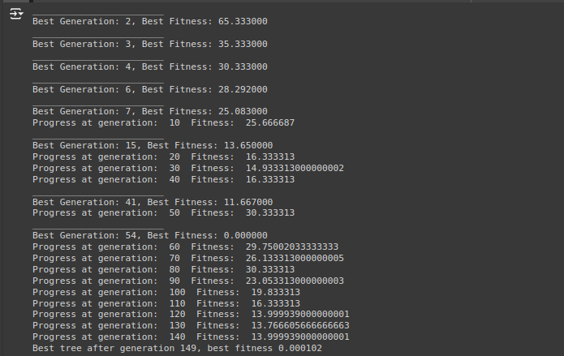
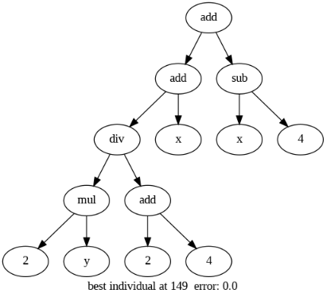
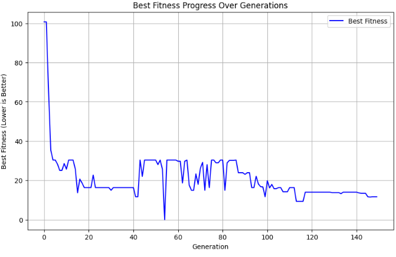
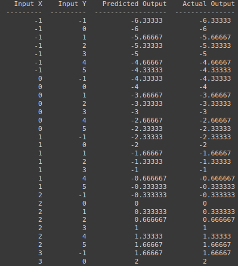

# Genetic Programming for Symbolic Regression

Genetic programming is an evolutionary algorithm inspired by natural evolution. This project implements a GP algorithm using symbolic regression to discover mathematical equations that fit a given dataset.

## Design of GP for Symbolic Regression

1. **Solution Representation**: Solutions are represented as trees with nodes as mathematical operations and leaves as input variables or constants.

2. **Initial Population**: Generate a starting population of random trees.

3. **Fitness Evaluation**: Assess the quality of solutions based on the sum of absolute errors between predicted and actual outputs.

4. **Solution Selection**: Use tournament selection to pick solutions for reproduction based on their fitness.

5. **Crossover Operation**: Merge genetic material of two parent solutions by exchanging subtrees.

6. **Mutation Operation**: Introduce random modifications in solutions by altering operations or variables in a tree.

7. **Solution Replacement**: Substitute solutions in the population with new ones based on fitness.

8. **Termination Condition**: Halt the algorithm after a predetermined number of generations or when a solution with acceptable fitness is discovered.

## Result Equation Using Genetic Programming

Parameters used:

- `POP_SIZE = 60`
- `MIN_DEPTH = 2`
- `MAX_DEPTH = 2`
- `XO_RATE = 0.8`
- `TOURNAMENT_SIZE = 5`
- `PROB_MUTATION = 0.2`
- `GENERATIONS = 100`
- `DESIRED_PRECISION = 0.00001`

After the 149th generation, the desired precision of 0.000102 is met, resulting in the following evolved solution:

- **Prefix Equation**: `(add (add (div (mul 2 y) (add 2 4)) x) (sub x 4))`
- **Postfix Equation**: `((((2 y mul) (2 4 add) div) x add) (x 4 sub) add)`

## Usage

1. **Initialize the Dataset**: Define the dataset within the notebook.
2. **Run the Genetic Programming Algorithm**: Execute the cells in the notebook to:
   - Initialize a population of random trees.
   - Evaluate the fitness of each individual.
   - Perform selection, crossover, and mutation.
   - Track and display the progress of fitness scores.
3. **Visualize the Results**: Display the best evolved tree, its equation, and a table comparing predicted and actual outputs.

## Visualizations

### Best Generation

### Equation Tree

### Progress Over Generations

### Actual vs Prediction
